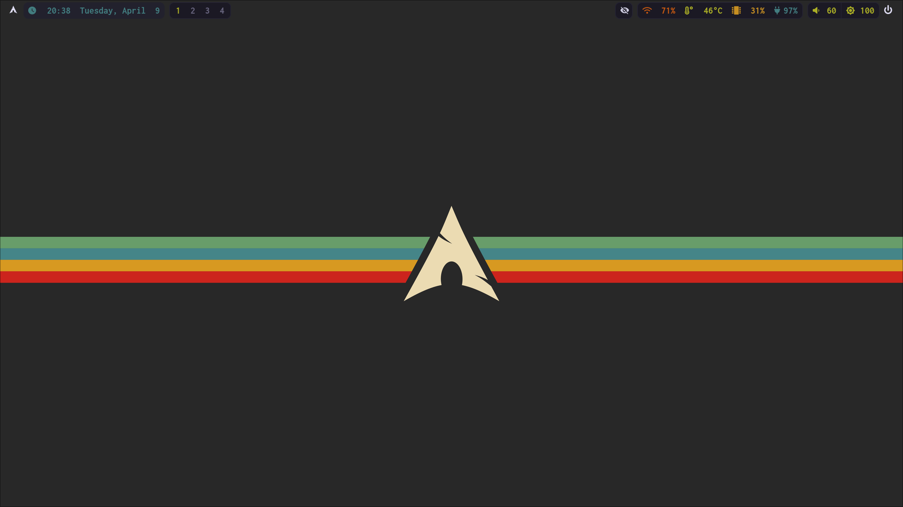
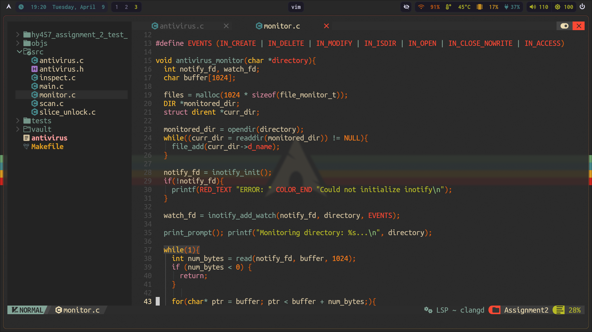
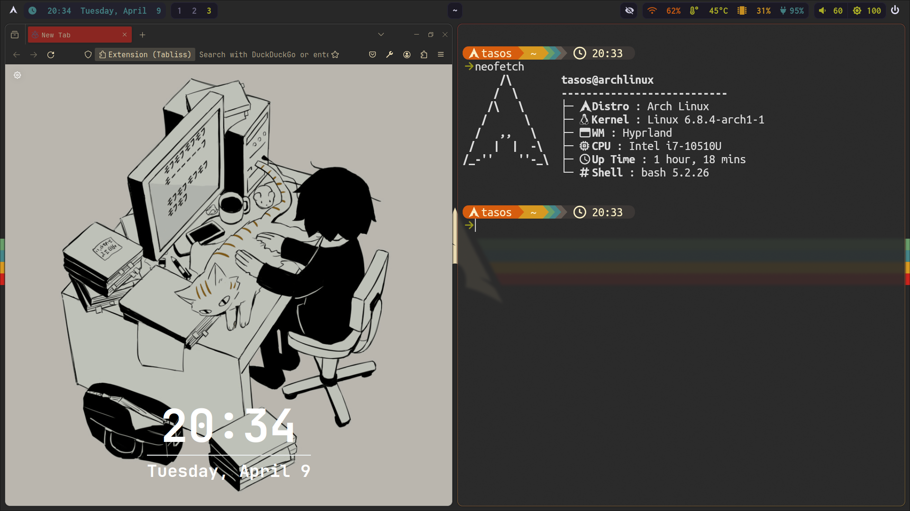

# Dotfiles
Dotfiles for my Arch/Hyprland Config

# Screenshots




# Installation
```
git clone https://github.com/tasath26/dotfiles ~
cp -r ~/dotfiles/* ~/.config
```

# Keybindings (so far)
| Keybinding      | Action                 |
|-----------------|------------------------|
| Super + Q       | Terminal               |
| Super + F       | Firefox                |
| Super + R       | App launcher           |
| Super + N       | Nautilus File manager  | 
